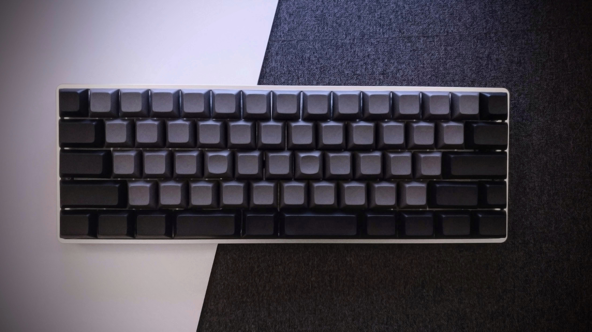

# My custom DZ60 keymap

This is my personal DZ60 keymap that I use on my custom mechanical keyboard:



I decided not to fork the official [QMK Firmware repository](https://github.com/qmk/qmk_firmware). Keeping this keymap in a separate repository gives me more flexibility.

## Build and flash

1. If you don't already have it, clone the QMK repository, open its directory and set it up:
	```
	git clone https://github.com/qmk/qmk_firmware.git
	cd qmk_firmware
	./util/qmk_install.sh
	```
2. Clone this repository into the DZ60 keymaps folder:
	```
	git clone https://github.com/Tomaszal/DZ60.git keyboards/dz60/keymaps/tomaszal
	```
3. Build and flash the firmware using the DFU programmer:
	```
	sudo make dz60:tomaszal:dfu
	```
4. Press the "RESET" key on your keyboard after these messages:
	```
	dfu-programmer: no device present.
	Error: Bootloader not found. Trying again in 5s.
	```
5. The keyboard should be flashed in a short amount of time.

## Layers

All keymap layer layouts can be found [here](http://www.keyboard-layout-editor.com/#/gists/1d173757b95645b6671b04adbe51b67d) or in the [keymap.c](keymap.c) file.
